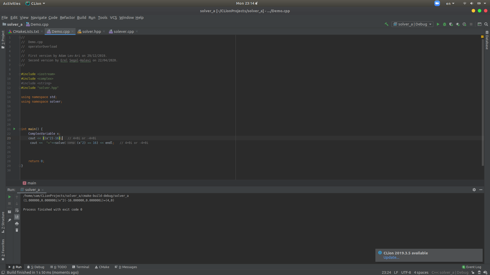

# FamilyTree
This  project is The Third assintment of C++ course in  Ariel university 
  
 
 Main features : 
  -  
  - solve an simple equation in R field .
  - solve an quadratic equation in R field .
  - solve an simple equation in C field .
  - solve an quadratic equation in C field .
  - print the function in it's  reduced view.

 

  
### Installation


Pull the file from the Git repository with the command : 
```sh
$ git clone https://github.com/simon-pikalov/cpp_3_a.git

```

# Photo



